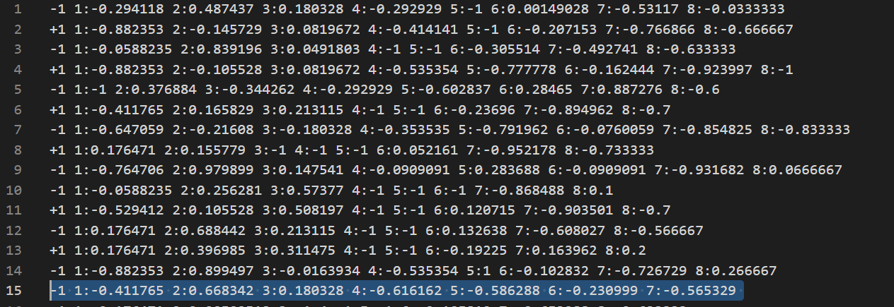
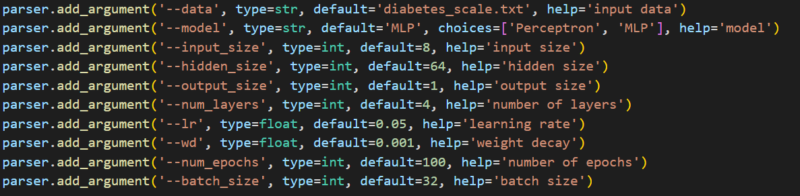

## Dataset: Pima Indians Diabetes

2 classes, 768 data, 8 features
diabetes_scale (scaled to [-1,1])

数据中有些行特征数不对，我们在将其转成numpy数组前进行了预处理，在对应位置补零

# Intro
使用感知机模型来预测糖尿病

Best Test Acc: 0.8116883116883117